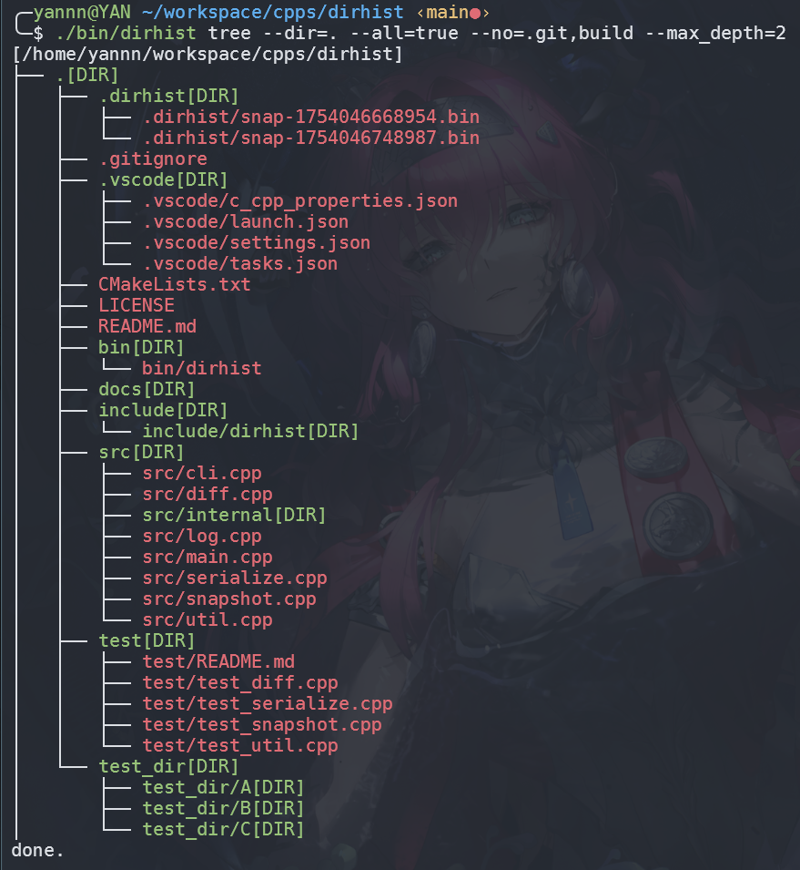
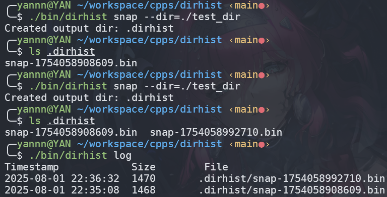
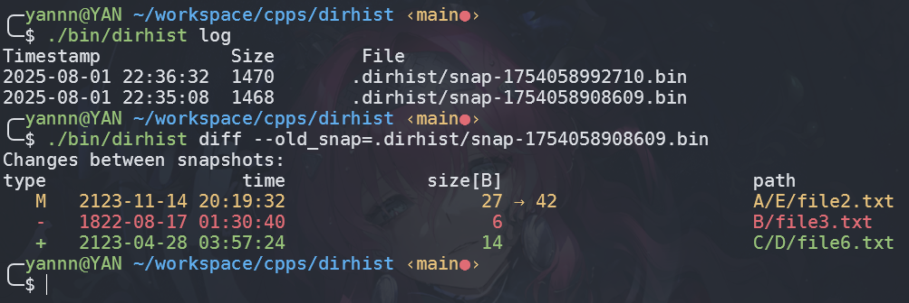
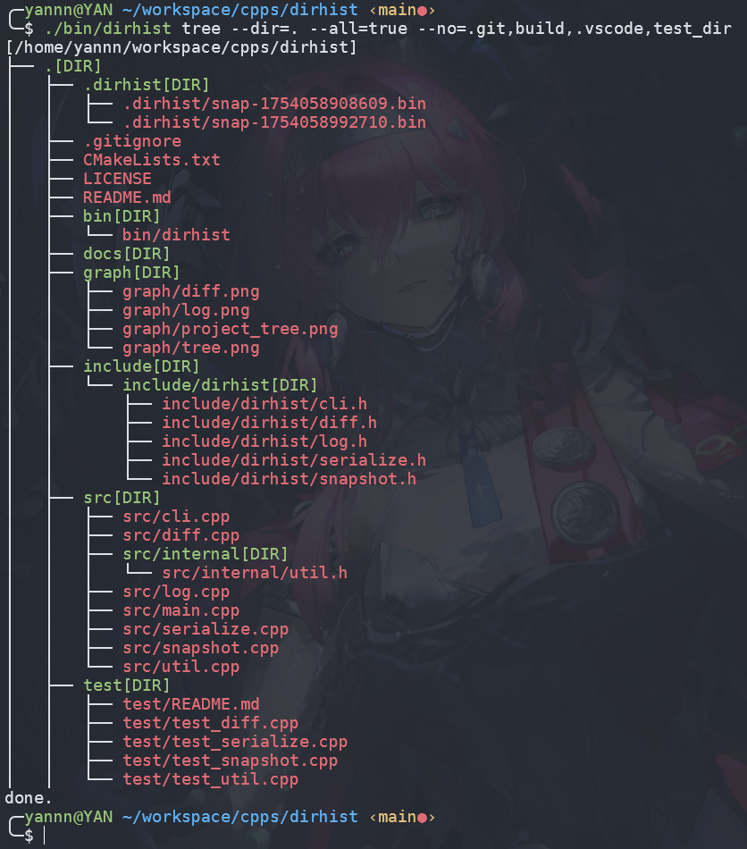

# dirhist

`dirhist` 是一个基于 Merkle 树的目录快照与历史管理工具，支持目录结构的快照、变更对比、历史日志查看等功能。适用于 Linux 环境下的目录版本管理、文件变更追踪等场景。

## 特性

- **目录快照**：递归扫描目录，生成高效的二进制快照文件，支持符号链接、隐藏文件等。
- **快照对比**：支持任意两个快照之间的差异对比，精准显示新增、删除、修改的文件或目录。
- **历史日志**：可查看指定目录下所有快照的时间、大小等信息。
- **目录树可视化**：以树状结构直观展示快照或当前目录结构。
- **快照清理**：一键清理指定目录下的所有快照文件。
- **命令行友好**：所有功能均通过命令行参数调用，易于集成脚本和自动化。

## 编译与安装

### 依赖

- C++17 编译器（如 g++ 7.0+）
- OpenSSL 开发库（用于 SHA256 哈希）

### 编译

推荐使用 CMake：

```bash
git clone https://github.com/HiJackiee/dirhist.git
cd dirhist
mkdir build && cd build
cmake ..
make
```

编译完成后，二进制文件位于 `build/dirhist`。

### 免编译二进制

你也可以直接下载 [Releases](https://github.com/HiJackiee/dirhist/releases) 页面提供的静态链接二进制版本

## 快速开始

### 1. 创建目录快照

```bash
./dirhist snap --dir=<目标目录>
```

快照文件默认保存在 `.dirhist/` 目录下，文件名形如 `snap-<timestamp>.bin`。

### 2. 查看目录树

```bash
./dirhist tree --dir=<目标目录>
# 或查看快照
./dirhist tree --file=<快照文件路径>
# 可选参数
# --max_depth=<n>   限制显示深度
# --all=true|false  是否显示隐藏文件
# --no=xxx,yyy      忽略指定文件/目录（逗号分隔）
```


### 3. 查看快照历史

```bash
./dirhist log [--dir=<快照目录>] [--num=<n>]
```
- `--num` 指定显示最近 n 条记录，默认全部。



### 4. 对比快照差异

```bash
./dirhist diff --old_snap=<旧快照> [--new_snap=<新快照>] [--dir=<快照目录>]
```
- 若不指定 `--new_snap`，默认对比最新快照。



### 5. 清理快照

```bash
./dirhist rm [--dir=<快照目录>]
```

## 目录结构

```
[/home/yannn/workspace/cpps/dirhist]
├── .[DIR]
│   ├── .dirhist[DIR]
│   │   ├── .dirhist/snap-1754058908609.bin
│   │   └── .dirhist/snap-1754058992710.bin
│   ├── .gitignore
│   ├── CMakeLists.txt
│   ├── LICENSE
│   ├── README.md
│   ├── bin[DIR]
│   │   └── bin/dirhist
│   ├── docs[DIR]
│   ├── graph[DIR]
│   │   ├── graph/diff.png
│   │   ├── graph/log.png
│   │   ├── graph/project_tree.png
│   │   └── graph/tree.png
│   ├── include[DIR]
│   │   └── include/dirhist[DIR]
│   │       ├── include/dirhist/cli.h
│   │       ├── include/dirhist/diff.h
│   │       ├── include/dirhist/log.h
│   │       ├── include/dirhist/serialize.h
│   │       └── include/dirhist/snapshot.h
│   ├── src[DIR]
│   │   ├── src/cli.cpp
│   │   ├── src/diff.cpp
│   │   ├── src/internal[DIR]
│   │   │   └── src/internal/util.h
│   │   ├── src/log.cpp
│   │   ├── src/main.cpp
│   │   ├── src/serialize.cpp
│   │   ├── src/snapshot.cpp
│   │   └── src/util.cpp
│   ├── test[DIR]
│   │   ├── test/README.md
│   │   ├── test/test_diff.cpp
│   │   ├── test/test_serialize.cpp
│   │   ├── test/test_snapshot.cpp
│   │   └── test/test_util.cpp
done.
```

## 进阶用法

- 支持自定义快照目录、快照文件名。
- 支持对比任意两个快照文件。
- 支持目录树输出高亮显示不同类型（目录/文件/符号链接）。

## 贡献

欢迎提交 issue 和 PR！如有建议或 bug，欢迎反馈。

## License

MIT License

---

**作者**：gnibnay  
**日期**：2025-07-28
